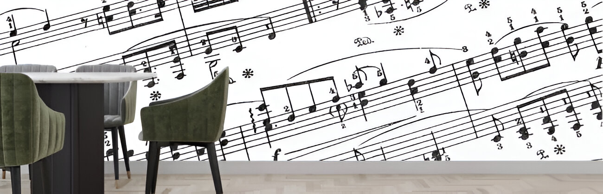

# Bag of songs



<br>

El proyecto "Bag of Songs: Extracción de Características en Señales de Audio", tiene como objetivo principal aplicar técnicas avanzadas de procesamiento de señales e Inteligencia Artificial para la distinción de géneros musicales. 

Mediante la utilización de un enfoque estructurado, se analizan los dominios frecuencial y temporal de piezas musicales, para generar un conjunto de datos que permita entrenar "modelos verdes" que puedan diferenciar efectivamente entre diversos tipos de música sin un coste computacional alto. Presentándose como principal alternativa frente al análisis de audio basado en el uso de espectogramas y CNNs, este enfoque combinando *feature extraction* junto con MLP o modelos de ML clásicos (SVM o RF) muestra una eficiencia elevada sin incurrir en los altos costes computacionales derivados de la alternativa existente. 

Proyecto desarrollado por:
- María Lourdes Linares Barrera  
- Pablo Reina Jiménez  

## Estructura del proyecto y uso

La estructura del proyecto es la siguiente.
```
/ccmusic
/ccmusic2
/img
/docs
    presentacion_PabloRJ_MLourdesLB.pdf
1-data-preparation.ipynb
2-features-explanaition.ipynb
3-models-prediction.ipynb
````

Donde:

- Las carpetas `/ccmusic` y `/ccmusic2` contienen los conjuntos de datos (se generan durante la ejecución del código en los pasos 1) Preparación de datos y 2) Generación de características). Si quiere proceder descargando directamente los datos generados, acceda al siguiente enlace y descargue y descomprima las carpetas en el directorio indicado [Enlace de descarga de datasets](https://drive.google.com/drive/folders/14kvMM9TbNkxPXs69Q0pHO_4XoQ0J4eUx?usp=sharing) o bien utilice la siguiente secuencia de comandos en Ubuntu/Debian:
```console
> pip install gdown
> gdown https://drive.google.com/uc?id=1NN51S_YnUDQOreWYiQvX1XSezl5t6qf-
> gdown https://drive.google.com/uc?id=1IscN0WMitrMgJuYCTzEm4XTLetWbHFO9
> sudo apt install unzip
> unzip ccmusic.zip
> unzip ccmusic2.zip
> rm ccmusic.zip
> rm ccmusic2.zip
```

- Los notebooks contienen el flujo de trabajo completo del proyecto, desde la preparación de los datos hasta la predicción de los modelos. A continuación se listan:
    - `1-data-preparation.ipynb`: Este notebook cubre el proceso de descarga del conjunto de datos y creación de la estructura de directorios.
    - `2-features-explanation.ipynb`: Este notebook contiene la extracción de características del dominio temporal y frecuencial de la señal. 
    - `3-models-prediction.ipynb`: En este notebook se entrenan los modelos y se realizan las predicciones sobre las características extraídas anteriormente. El modelo resultante tiene una efectividad de 97,78% de f1 en la distinción de los géneros musicales.

* La carpeta `/img` almacena imágenes incrustadas en los notebook.
* La carpeta `/docs` contiene una presentación del trabajo realizado.


____ 
